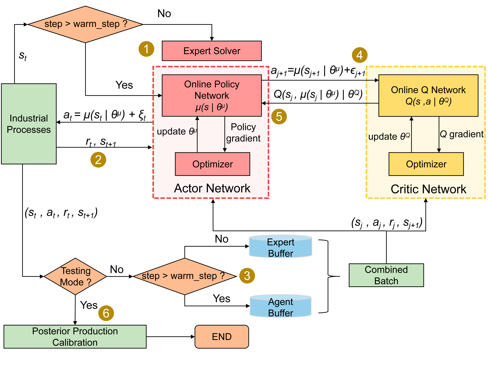

# CORE-DDPG
## About
This repository contains the code and resources of the following paper:

Constrained-Optimized Robust Expert-Based Deep Deterministic Policy Gradient for Real-Time Energy Management of Continuous Industrial Processes

## Overview of the framework
Constrained-optimized robust expert-based deep deterministic policy gradient (CORE-DDPG) is a novel deep reinforcement learning (DRL) algorithm for real-time optimization based on real-time pricing (RTP) with continuous actions. 

 

## Key Files and Directory Structure:
`main.py`: The core execution script, encompassing both the training and prediction/inference pipelines for the model.

`utils.py`: Contains various utility functions used throughout the project, such as data processing, helper calculations, etc.

`price_retrieval.py`: A functional module responsible for price retrieval logic.

`price_data/`: This directory serves as the price database or storage for related price data files.

`single_equ_SA/`: This directory holds individual settings or configurations specific to each piece of equipment.

`wzytest/`: This folder is used to store loaded training state files (checkpoints/saved models). For instance, during the training process, model parameters and progress can be periodically saved (commonly referred to as checkpoints or saved models). When you need to resume training or run tests, these saved files can be placed in this directory to be loaded by the application.

## License
CORE-DDPG is licensed under the Apache License, Version 2.0: http://www.apache.org/licenses/LICENSE-2.0.

